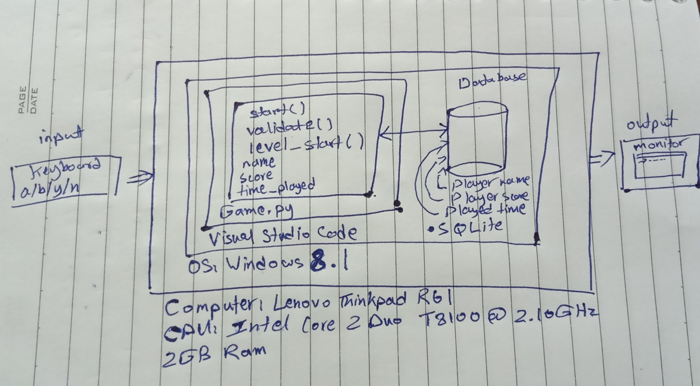

# Unit 1: A classic game 

# Criteria A: Planning

## Problem definition

The owner of the local game shop is an enthusiast of classic computer games. He has been looking for a talented programmer that can help him revive his passion for text-based games. He has few requirements for this task:

1. The game has to be entirely text-based.
2. The game must record the time played.
3. The game must record the player name and score.

Apart for this requirements, the owner is open to any type of game, topic or genre.

## Proposed Solution

### Design statement:
I will design and develop a text-based game for a client who is a game shop owner. The game will be a turn-based colosseum fighting game and will be developed using Python. It will take around 3 weeks to develop and will be evaluated according to the success criteria below.

### Justification of proposed solution:
I chose python because:
   - It has a simple and concise syntax and is a dynamic language which is the best option for a program like this. 
  
   - It is easy to get input from the user using the ``input()`` function compared to languages like C, C#, Golang, Rust, etc.
   
   - It is a productive language, which means we get to focus more on solving the actual problem and not understanding the syntax for example. And this is needed for a program with a short development time.
   
   - It is portable, if we develop the program on one OS it will run on others without having to change the code.
   
   - Vast support. Python is one of the most popular programming languages in the world right now, so it has ton of support like specific bug solutions (on Stack Overflow for example)
   
   - It has a huge standard library, so we won't have to depend on many external libraries.
 
## Success Criteria
1. The game has to be entirely text-based.
2. The game must record the time played.
3. The game must record the player name and score.
4. The game must print clear messages when requesting input from the user, displaying the different options the user has and what they do. 
5. The game must validate any input from the user to check whether it's correct or not.
6. The game must have a tutorial to teach the user controls and rules.

# Criteria B: Design
## Theme
I named my game "YUUSHA NO TSURUGI" (勇者の剣) which roughly translates to "Sword of the Hero" in English, I chose Japanese because I like it as a language and because Japan has made a lot of good fighting games. The game is set somewhere in the Roman Empire, where the player is a gladiator participating in a colosseum tournament against 10 enemies and each enemy is a level, I chose this theme because I found it suiting for a tournament fighting game.

## System Diagram

## Flow Diagrams
## encode()

## get_name()

## validate()

## Record of Tasks
| Task No | Planned Action                    | Planned Outcome                                                         | Time estimate | Target completion date | Criterion |
|---------|-----------------------------------|-------------------------------------------------------------------------|---------------|------------------------|-----------|
| 1       | Create system diagram             |                                                                         | 10 Minutes    | 24/9/2021              |           |
| 2       | Code the database logic (sqlite3) | Have a functioning sqlite3 databse to insert, get and modify user data. | 30 Minutes    | 27/9/2021              |           |
|         |                                   |                                                                         |               |                        |           |
